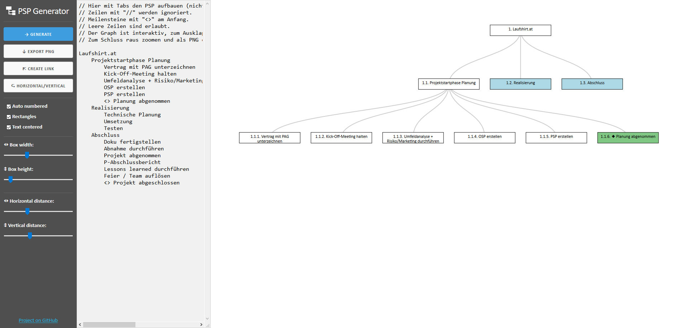

# PSP Generator
Ein Baum-Generator-Tool basierend auf Text-Einrückungen für einfache Projektstruktur-Pläne.

Hier ausprobieren: [PSP Generator](https://tryops.github.io/psp-generator/)

## Anleitung
- Mit Tabs den PSP im Textfeld aufbauen oder hineinkopieren (Wichtig: Es müssen Tabs sein, keine Spaces!):
  - Zeilen mit `//` werden ignoriert (Kommentare).
  - Knoten/Boxen werden als Meilensteine dargestellt, wenn der Text mit `<>` beginnt (z.B. `<> Planung abgenommen`).
  - Leere Zeilen sind erlaubt.
- Dann auf den `GENERATE`-Button klicken, der PSP wird generiert.
- Der Graph ist interaktiv, blaube Boxen lassen sich mit Klicken ausklappen.
- Zum Anpassen lassen sich bei der Seitenleiste beliebige Einstellungen vornehmen.
- Zum Schluss ganz hinaus zoomen (der ganze PSP muss sichtbar sein) und als PNG exportieren (`EXPORT PNG`).
  - Als Upscale-Faktor einen passenden wählen (ausprobieren), sodass das Bild nicht verpixelt ist. 
  - Exportieren (_kann eine Weile dauern je nachdem wie groß das Bild ist_)!
  
- Es lassen sich auch Links für einen PSP erstellen (`CREATE LINK`). 
  - Wird der erstellte Link aufgerufen, wird der verlinkte PSP wieder hergestellt. 
  - Dadurch kannn man den PSP später nochmals interaktiv ansehen. 
  - Das Textfeld kann hierfür auch "ausgeblendet" werden (an der rechten unteren Ecke das Textfeld ganz nach links ziehen). 

Inspiriert von [Text2MindMap](https://tobloef.com/text2mindmap/)
